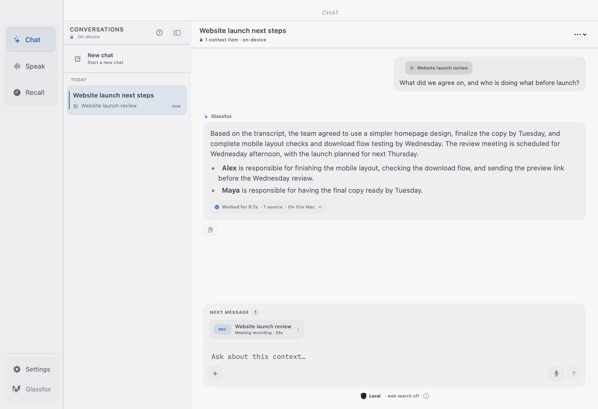
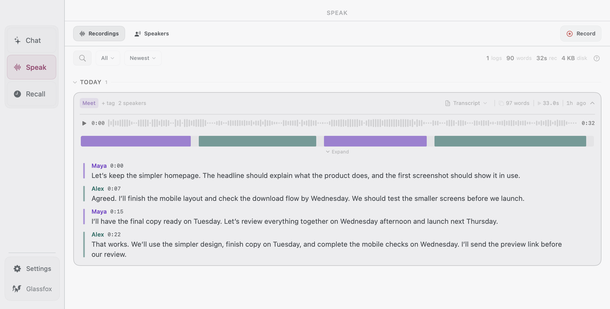
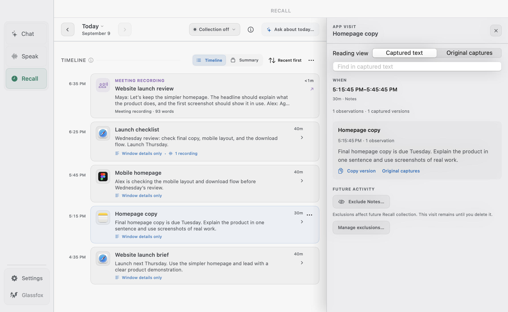

  <a href="https://tryenzo.ai">
    <picture>
      <source media="(prefers-color-scheme: dark)" srcset=".github/enzo-lockup-light.svg">
      
    </picture>
  </a>

  <b>Your own AI assistant, right on your Mac.</b> 
  Dictate into your apps, turn meetings into useful notes, and ask questions about your documents and work. 
  Powered by local models. Private by default.

> **Enzo preview, formerly Glassfox and Chirp.** The features, screenshots, and plans below describe the upcoming release. The download currently provides **Chirp 1.5.4**.
>
> **Enzo plans:** Unlimited voice typing, free. Pro is **$39 once**, with a **10-day trial**.

  <a href="https://github.com/selcamx/enzo/releases/latest"><b>Download current release: Chirp 1.5.4</b></a> 
  <a href="https://tryenzo.ai">Website</a>
  &nbsp; · &nbsp; <a href="https://github.com/selcamx/enzo/releases">Release notes</a>
  &nbsp; · &nbsp; <a href="https://github.com/selcamx/enzo/issues">Get help</a>

  Apple Silicon (M1 or newer) · macOS 15+ · English dictation and meetings

## Chat: ask questions about your work

Ask about a document, recording, or your current screen, then inspect the sources
behind the answer. Chat works without meeting recordings or Recall.

For example: **“What did we agree on, and who owns the next steps?”**

*Historical Glassfox preview, generated locally from a sample meeting. This screenshot does not show the current Enzo build.*

## Speak: turn speech into text and meeting notes

Dictate an email into your app, or record a meeting with microphone and call audio.
Get speaker labels without a meeting bot. Search transcripts, replay a moment,
and turn recordings into notes.

### Solo — dictation
Tap your hotkey, speak, tap again. Text appears at your cursor, in any Mac app, with no per-app setup. English, transcribed up to 120× faster than real-time. (Holding the hotkey is the Meeting Mode gesture.)

*Historical Glassfox preview with sample meeting content.*

## Recall: find the page or document you had open

Find a proposal you read earlier or revisit the work around a meeting. Recall
saves a timeline of apps and readable context you can inspect or ask about.
It works independently of recording.

- **Runs on-device** — audio and text never leave your Mac. No account, no cloud.
- **Lives in the notch** — one tap to start, invisible the rest of the time.
- **Speaker library** — voices remembered and matched across meetings.
- **Searchable history** — every transcript, with audio playback.
- **Word-level timestamps** — scrub a long recording to the exact word.
- **Punctuation and formatting** — transcripts come out punctuated, capitalized, and broken into readable paragraphs, in both modes.
- **Chirp Intelligence** — turn a transcript into a meeting summary, a cleaned note, or an email draft, and ask typed or spoken questions about it. Runs on your Mac; the original transcript is never altered.
- **MCP server** — query your transcripts from Claude and other MCP clients.
- **Notarized and auto-updating** — signed with an Apple Developer ID, updates over Sparkle.
- **One-time purchase** — every feature and all future updates, no subscription.

Recall starts off. Captured context is encrypted locally and kept for 30 days by
default. You control collection, app exclusions, retention, export, and deletion.
There is no screenshot archive.

*Historical Glassfox preview with sample project activity.*

## Start free

Get the latest `.dmg` from [chirpvoice.com](https://chirpvoice.com/#download) or [GitHub Releases](https://github.com/selcamx/chirp/releases). Every feature is unlocked for 10 days, no account and no card required.

| Starter, free with no expiry | Pro, $39 once |
| --- | --- |
| Unlimited voice typing | Everything in Starter |
| Saved recordings, transcript search, playback, and tags | Meeting recording with speaker labels |
| Today's Recall timeline and earlier-day app activity overviews | Full retained Recall history and context search |
| Recall privacy, retention, and export controls | New Chat answers, notes, drafts, and daily briefs |

The **10-day Pro trial** starts with intentional Pro use, not setup or downloads.
No card or account required. Saved recordings and generated results stay readable
after the trial ends.

One-time license. Pay once, use forever. No subscription, no account.

| Plan | Price | What you get |
|------|-------|--------------|
| Starter | Free, forever | Unlimited Solo dictation, searchable history with tags, and playback of your own recordings |
| Pro | $39 one-time, up to 3 Macs | Everything in Starter, plus Meeting Mode with speaker identification, the speaker library, Chirp Intelligence, and all future updates |

After the 10-day trial the app doesn't lock — it moves to Starter, and everything already in your history stays where it is.

Dictation, meeting transcription, speaker recognition, and Recall collection run
on your Mac. Chat also runs locally by default, using downloaded models.

You can enable web research or cloud answers. Cloud answers use your own DeepSeek
API key and send your question, recent conversation, and selected text context
to DeepSeek; provider charges apply. Downloads, updates, licensing,
and optional analytics also use the internet.

[Read the privacy policy](https://tryenzo.ai/privacy).

## Your first few minutes

Follow Enzo setup to grant permissions and download models. Dictate a short message
with your chosen shortcut, then attach a document in Chat to try Pro.
Enable Recall when you'd like a work timeline.

## A few useful details

What happened to Chirp?

Existing Chirp licenses and recordings carry over to Enzo. Original license
activation limits are preserved.

What does the Pro license cover?

One active Mac, transferable, with future updates included. Pro can use retained
Recall context collected on Starter; it cannot recover missing or deleted activity.

Can I see dictation as I speak?

Yes. Install and enable the optional live-transcription component. Live voice
typing is free; meetings require Pro or its trial.

What leaves my Mac when I enable connections?

Cloud context can include text from recordings, Recall, files, or your screen,
but not raw audio, files, or images. Web research sends search queries and fetches
pages. External assistants connected through MCP handle transcript excerpts
according to their own settings.

## Support

[Report a bug or request a feature](https://github.com/selcamx/enzo/issues),
or email [hello@glassfox.ai](mailto:hello@glassfox.ai) for private support or billing.

This is the release and issue-tracking repository for a commercial Mac app.
The app's source code is not published here.
